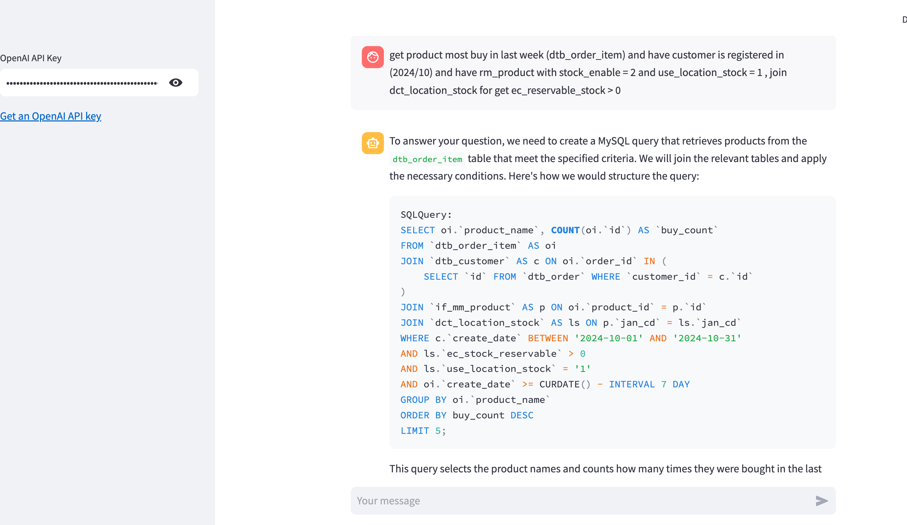

# Write query sql from description

Với developer, viết truy vấn sql là công việc thường xuyên, đặc biệt những truy vấn hằng ngày để checking dữ liệu, tìm kiếm thông tin, thống kê, ...

Công việc lặp đi lặp lại không chỉ tốn thời gian và đôi khi gây nhàm chán.

Mình tạo ra tool này để tận dụng openAI cho việc truy vấn bằng ngôn ngữ tự nhiên, giúp cho việc viết truy vấn sql nhanh hơn, tự động hóa hơn và fun hơn :D

Có opensource hết rồi các bạn, langchain community, cứ thể ráp vào triển thôi :D



------------------------------------------------------------------------------------

For developers, writing SQL queries is a frequent task, especially daily queries for checking data, searching for information, statistics, etc.

Repetitive work not only takes time but can also become boring.

I created this tool to leverage OpenAI for querying in natural language, making SQL query writing faster, more automated, and more fun :D

It's all open source, folks, langchain community, just plug and play :D

## How to use

1. Clone project
```bash
git clone
```

2. Install requirements
```bash
pip install -r requirements.txt
```

3. Run streamlit app
```bash
streamlit run app.py
```

4. Open browser and access to `http://localhost:8501`
5. Write description and get sql query
6. Enjoy!

## Stack use
langchain, streamlit, pymysql


Ref:
- https://python.langchain.com/v0.2/docs/how_to/sql_large_db/
- https://python.langchain.com/v0.2/docs/how_to/sql_query_checking/
- https://python.langchain.com/v0.2/api_reference/core/runnables/langchain_core.runnables.history.RunnableWithMessageHistory.html

