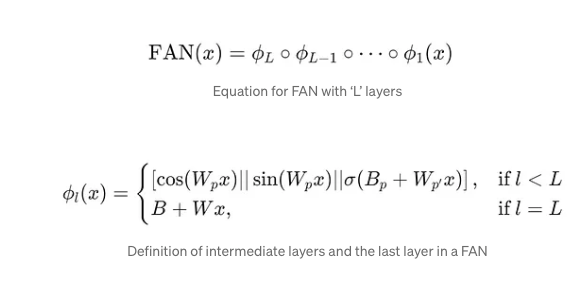
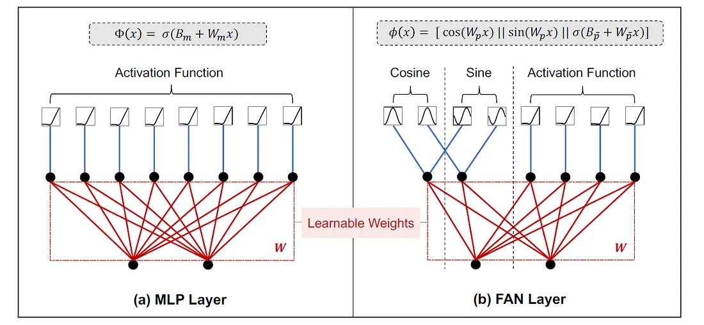
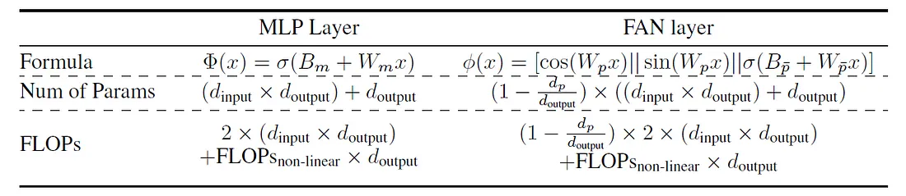
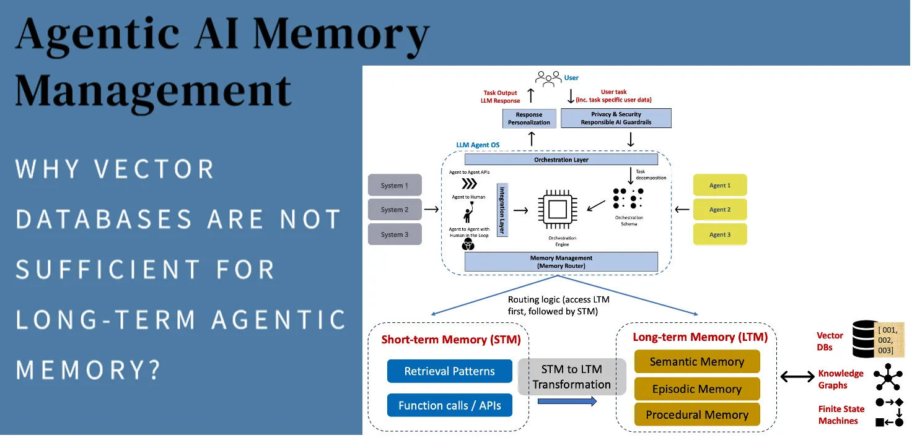
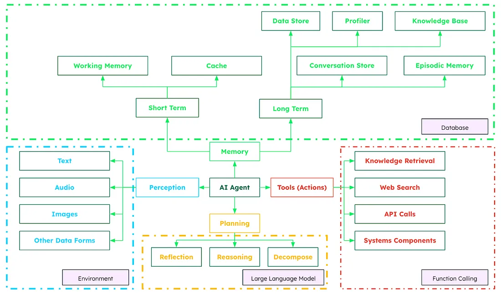

https://levelup.gitconnected.com/fourier-analysis-networks-fans-are-here-to-break-barriers-in-ai-1c521c6656bc

https://en.wikipedia.org/wiki/Universal_approximation_theorem

https://ai.gopubby.com/long-term-memory-for-agentic-ai-systems-4ae9b37c6c0f

https://medium.com/mongodb/what-are-ai-agents-from-virtual-assistants-to-intelligent-decision-makers-817b8b205f33

